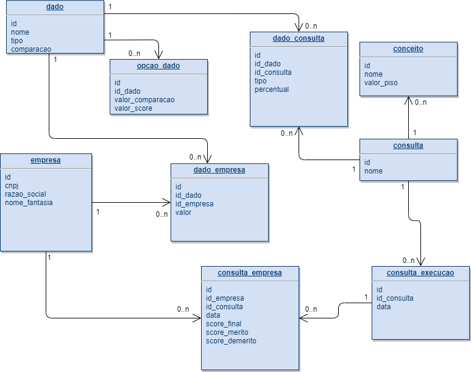

# NeoCredit

Módulo para realizar avaliação de crédito de empresas.



## Requerimentos

Itens necessários para executar aplicação:

- [JDK 1.8](http://www.oracle.com/technetwork/java/javase/downloads/jdk8-downloads-2133151.html)
- [Maven](https://maven.apache.org)
- [PostgreSQL](https://www.postgresql.org/)

## Executando aplicação

Primeiro é necessario confgurar uma coneção com postgreSQL editando o arquivo **application.properties.**

* src
    * main
        * resources
            * application.properties
            
Depois de configurada a conexão é possível executar com seguinte comando:

```shell
mvn spring-boot:run
```

## Exemplos utilização

Objetos json.

* Dado:

```json
{
   "nome" : "Nome do Dado",
   "tipo" : "NUMERICO",  ##NUMERICO ou LOGICO
   "comparacao" : "MAIOR_IGUAL", ##IGUAL, MENOR_IGUAL ou MAIOR_IGUAL
   "listaOpcoa" : [{
    	"valorComparacao" : "5",
    	"valorScore": 500
    },
    {
       	"valorComparacao" : "10",
       	"valorScore": 1000
    }]
}
```
* Empresa:

```json
{
    "cnpj" : "000000000000",
    "razao_social" : "razao social",
    "listaDado": [
       {"dado": {"nome":"Meses"}, "valor": "100"},
       {"dado": {"nome":"SITUACAO"}, "valor": "ATIVA"},
       {"dado": {"nome":"Atividade"}, "valor": "Alto"}
     ]
}
```
* Consulta:

```json
{
	"nome" : "nome consulta",
	"listaConceito": [
		{
			"nome": "Q1",
			"piso": 751
		},
		{
			"nome": "Q2",
			"piso": 501
		},
		{
			"nome": "Q3",
			"piso": 251
		},
		{
			"nome": "Q4",
			"piso": 0
		}
	],
	"listaDadoConsulta": [
		{
			"dado" : {"nome": "Meses"},
			"percentual" : 10,
			"tipo" : "M"
		},
		{
			"dado" : {"nome": "SITUACAO"},
			"percentual" : 50,
			"tipo" : "M"
		},
		{
			"dado" : {"nome": "PFIN"},
			"percentual" : 15,
			"tipo" : "D"
		}
	]
}
```
Rotas API.

| Método  | Rota                | Parâmetro                          | Ação                                                     | 
|---------|---------------------|------------------------------------|----------------------------------------------------------|
| `POST`  | `/dado`             | Json dado                          | Cadastra um novo dado                                    |
| `GET`   | `/dado`             |                                    | Retorna todos os dados                                   |
| `GET`   | `/dado/{id}`        | Número id                          | Retorna dado por id                                      |
| `DELETE`| `/dado/{id}`        | Número id                          | Remove dado                                              |
| `POST`  | `/dado/list`        | Array Json dado                    | Cadastra uma lista de dados                              |
| `POST`  | `/empresa`          | Json empresa                       | Cadastra uma empresa                                     |
| `GET`   | `/empresa`          |                                    | Retorna todas as empresas                                |
| `GET`   | `/empresa/{id}`     | Número id                          | Retorna empresa por id                                   |
| `DELETE`| `/empresa/{id}`     | Número id                          | Remove empresa                                           |
| `POST`  | `/empresa/list`     | Array Json empresa                 | Cadastra uma lista de empresas                           |
| `POST`  | `/consulta`         | Json consulta                      | Cadastra uma consulta                                    |
| `GET`   | `/consulta`         |                                    | Retorna todas as consultas                               |
| `GET`   | `/consulta/{id}`    | Número id                          | Retorna consulta por id                                  |
| `DELETE`| `/consulta/{id}`    | Número id                          | Remove consulta                                          |
| `POST`  |`/consulta/exec/{id}`| Número id e Array String com os cnpj das empresas | Executa consulta                          |
